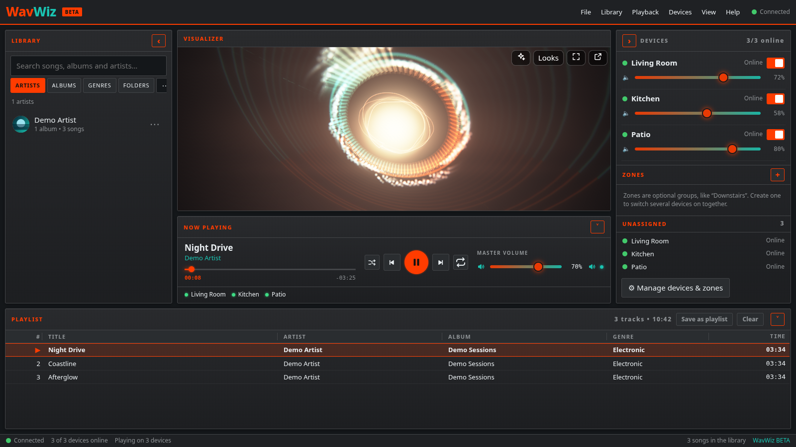
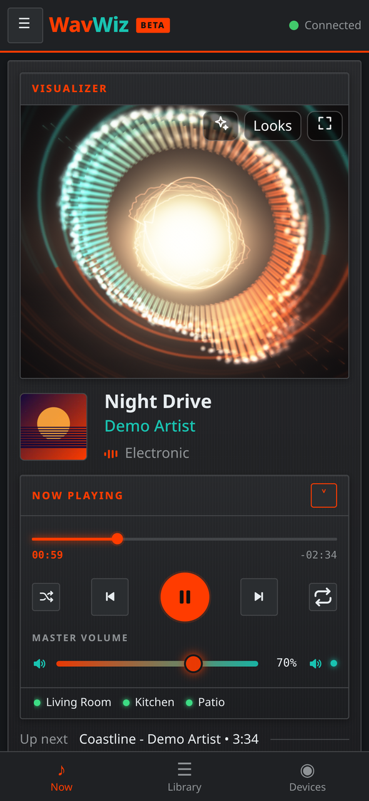
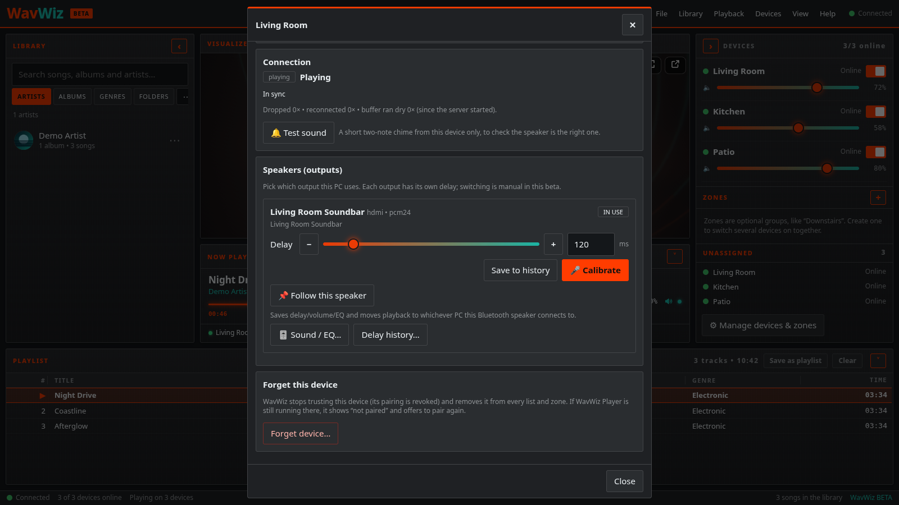
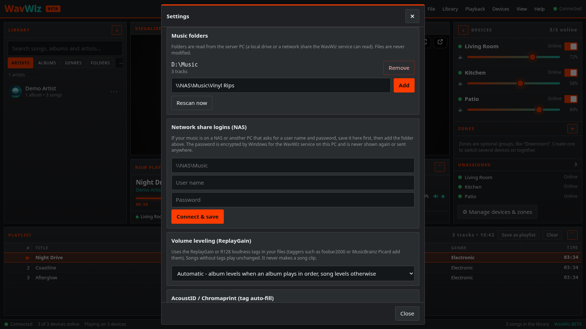
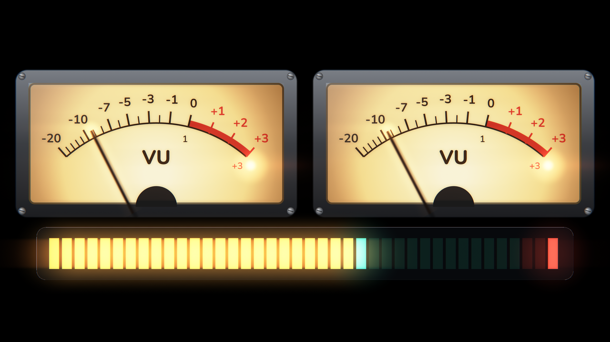
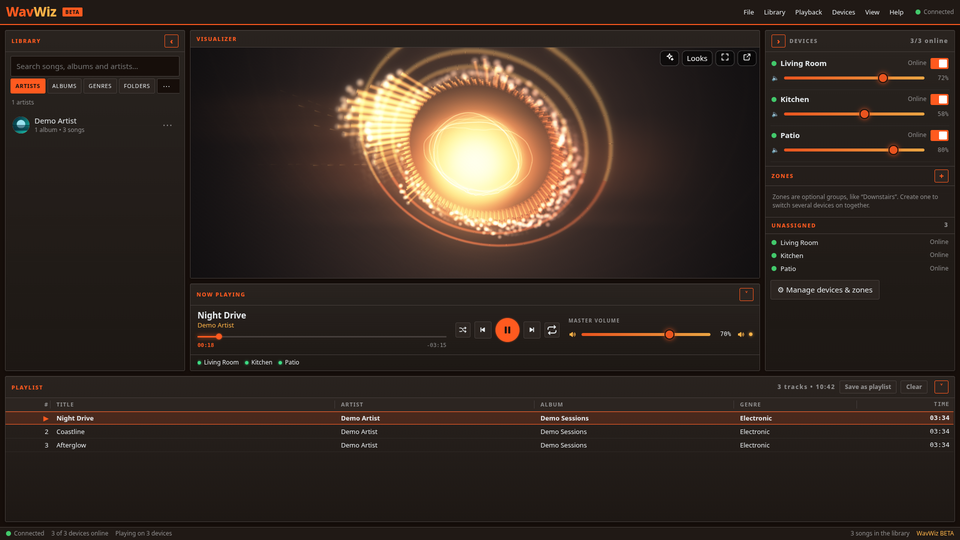
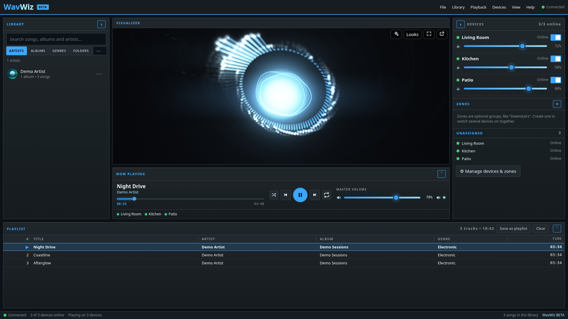
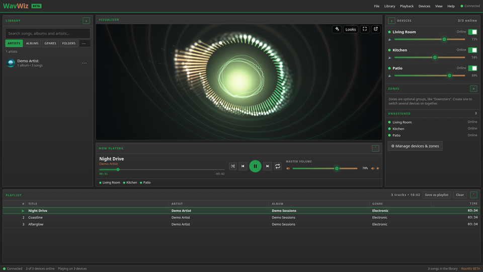
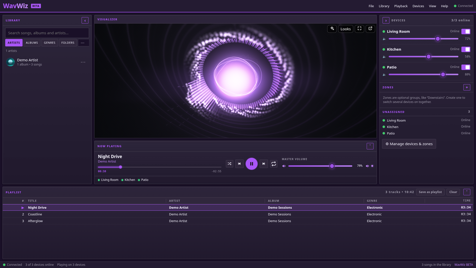
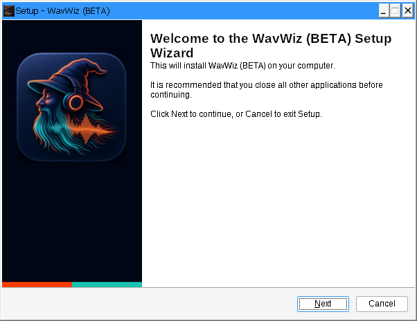

<p align="center">
  
</p>

# WavWiz

[](LICENSE)
[](CHANGELOG.md)
[](https://wavwiz.com)

**Whole-home audio wizardry.**

WavWiz turns an always-on Windows PC into a whole-home music server. Your library and internet radio play in sync on your PCs, phones, and tablets. Phones play from the browser, with no app to install. No cloud account, no analytics, no telemetry, and WavWiz doesn't open ports to the internet. (Internet radio, tag/cover lookups, and the optional Spotify Connect reach the internet when you use them.)

> **Public beta.** Expect rough edges and frequent updates. Please report bugs via [GitHub Issues](https://github.com/vdubbin74/WavWiz/issues).

**Download:** [latest release for Windows](https://github.com/vdubbin74/WavWiz/releases/latest) · **Website:** [wavwiz.com](https://wavwiz.com) · **Repo:** [github.com/vdubbin74/WavWiz](https://github.com/vdubbin74/WavWiz)

---

## Screenshots



| Phone (browser) | Per-device delay | Add a music folder |
| --- | --- | --- |
|  |  |  |

**Visualizers**

| Graphic EQ | Ring | Speaker cone |
| --- | --- | --- |
|  |  |  |
| **Terrain** | **VU meters** | |
|  |  | |

**Themes**

| Ember | Arctic | Pepecoin | Violet Pulse |
| --- | --- | --- | --- |
|  |  |  |  |

**Installer**



---

## Features

- **Whole-home sync** — Every device plays the same stream against a shared clock, and WavWiz keeps correcting each device's drift: Windows PCs with WavWiz Player, plus phones, tablets, and Macs in the browser. No sync measurements are published yet.
- **Per-device delay (0–1000 ms)** — Live slider and number box so Bluetooth speakers, TV audio, and Wi-Fi PCs line up instead of echoing between rooms.
- **AirPlay, built in** — The server appears as the AirPlay speaker **WavWiz – Whole House**. Send audio from apps on iPhone, iPad, or Mac; it plays in every room in sync, with title and artwork on Now Playing.
- **Optional Spotify Connect** — Off by default. Turn it on in Admin settings; WavWiz appears in Spotify’s device list and streams to every room. **Requires your own Spotify Premium account.** Unofficial open-source client (librespot); not made or endorsed by Spotify.
- **Library** — Browse artists, albums, genres, and folders; playlists; queue; internet radio; optional CD ripping, and missing tags/covers suggested from MusicBrainz (nothing is written until you approve it). Password-protected NAS shares, gapless album playback, and automatic volume leveling (ReplayGain / R128).
- **Zones** — Group devices (for example “Downstairs”) with per-device volume and on/off.
- **Visualizers** — Eight original looks (Particle burst, Waveform river, Speaker cone, Ring, Neon tunnel, Terrain, VU meters, Graphic EQ), each with its own 0–100% effect controls, a Quality setting (Auto / Low / High / Ultra), and GPU post effects.
- **Privacy-first** — Local network only by default. Optional private remote access via Tailscale (you bring your own Tailscale setup); WavWiz does not open ports to the public internet for you.

AirPlay is a trademark of Apple Inc. Spotify is a trademark of Spotify AB. WavWiz is not affiliated with either.

---

## Requirements

| Role | Needs |
| --- | --- |
| **Server** | 64-bit Windows 10 (October 2018 Update or newer) or Windows 11, on a PC that stays on; admin rights to install (self-contained installer; nothing else to install for the core app) |
| **Players** | Windows PCs with speakers (WavWiz Player), or any modern browser on a PC, Mac, phone, or tablet on the same network. Smart-TV built-in browsers don't work yet; for a TV, use a PC or laptop connected to it |
| **Player window** | Microsoft Edge WebView2 Runtime (included with Windows 11 and current Windows 10); without it the player opens in your default browser |
| **Spotify Connect** (optional) | Listener’s own **Spotify Premium** account; feature off by default |
| **AirPlay** | iPhone, iPad, or Mac on the same home network (Private network profile recommended) |

The installer is **not Authenticode-signed yet**, so Windows SmartScreen may warn. Prefer downloads from the official [Releases](https://github.com/vdubbin74/WavWiz/releases) page only.

---

## Quick install

1. Open [Releases](https://github.com/vdubbin74/WavWiz/releases/latest) and download the latest `WavWiz-Setup-*.exe`.
2. Verify the published SHA-256 if one is listed on the release.
3. Run the installer:
   - On the music PC: install **WavWiz Server**, keep the **Private / home-network** address (do not bind to all interfaces), finish, open the web UI, set an administrator password, add music folders.
   - On each PC with speakers: install **WavWiz Player**; it discovers the server—pair with the code from Settings if asked.
4. Read [docs/FIRST-RUN.md](docs/FIRST-RUN.md) for Private network, AirPlay, and optional Spotify Connect tips.

More detail: [wavwiz.com](https://wavwiz.com).

---

## Build from source

High-level overview (Windows or a cross-build environment with the tools described in the repo):

```text
dotnet build WavWiz.sln -c Release -warnaserror
dotnet test tests/WavWiz.Core.Tests -c Release
# also: Dsp, Measure, Sim, Server.Tests; tests/js/run.sh; installer script tests
build/build-ffmpeg-lgpl.sh          # LGPL-only FFmpeg (when rebuilding media stack)
pwsh build/build.ps1 -Installer     # win-x64 publish + Inno Setup installer
```

Project layout and deeper notes: see `docs/` in this repository (architecture, installer). For first-time users of a binary install, start with [docs/FIRST-RUN.md](docs/FIRST-RUN.md). Third-party and LGPL obligations: [docs/THIRD-PARTY.md](docs/THIRD-PARTY.md) and [THIRD-PARTY-NOTICES.txt](THIRD-PARTY-NOTICES.txt).

---

## Contributing & support

- Contributing: [CONTRIBUTING.md](CONTRIBUTING.md)
- Code of conduct: [CODE_OF_CONDUCT.md](CODE_OF_CONDUCT.md)
- Help / bugs: [SUPPORT.md](SUPPORT.md)
- Security: [SECURITY.md](SECURITY.md) — please **do not** file public issues for vulnerabilities
- Changelog: [CHANGELOG.md](CHANGELOG.md)

---

## License

[MIT](LICENSE) — Copyright (c) 2026 vdubbin74

Third-party components keep their own licenses; see [THIRD-PARTY-NOTICES.txt](THIRD-PARTY-NOTICES.txt) and [NOTICE](NOTICE).

---

*(WavWiz was called “Unison” in very early betas; the installer upgrades in place and keeps library, settings, and pairings.)*
